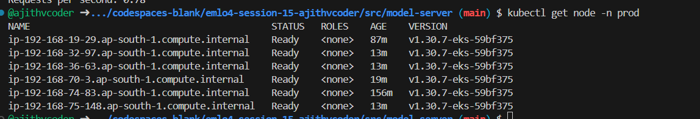
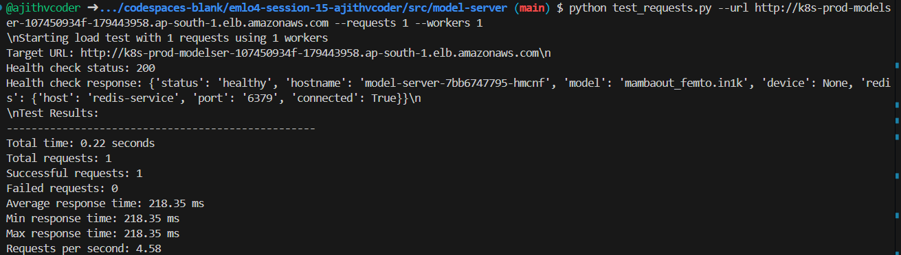

## EMLOV4-Session-15 Assignment - Kubernetes - III: EKS, ALB, Auto Scaling

Using Helm charts, we are deploying a `cat-dog model service` hosted on a FastAPI server with loadbalancer and auto scaling capablity in `AWS EKS` platform. Alongside, a `backend service built with FastAPI` handles requests. The `NextJS UI service` functions as the front-end interface for users. Additionally, a `Redis caching service` is integrated to enhance performance. Finally its exposed to internet with `aws-loadbalancers`. Cluster autoscaling(`CA`) and horizontal pod autoscaling(`HPA`) is used for `model-server`

### Contents

- [Requirements](#requirements)
- [Development Method](#development-method)
    - [Architecture Diagram](#architecture-diagram)
    - [Installation](#installation)
    - [Cluster Creation](#cluster-creation)
    - [Install loadbalancer and kubernetes dashboard](#install-loadbalancer-and-kubernetes-dashboard)
    - [Cluster Autoscaler](#cluster-autoscaler)
    - [Horizontal Pod Autoscaler](#horizontal-pod-autoscaler)
    - [Testing](#testing)
    - [Deletion Procedure](#deletion-procedure)
- [Learnings](#learnings)
- [Results Screenshots](#results-screenshots)

### Requirements

- You will be deploying the previous assignment with EKS with CA & HPA
- Before you begin changing anything, first create an Architecture Diagram
- Create HELM Chart for the entire deployment
    - You must use helm to deploy this
    - no k apply -f
- You must use ClusterAutoScaler, and HorizontalPodScaler
    - Create an artificial load on the service
    - Print the Latency of the Inference
    - Log the HPA metrics, like we did in the session
    - Your Pods and Nodes should automatically scale out and scale in when needed.
- What to Submit
    - Github repository will all the above changes
    - must have the helm chart
    - Instructions to deploy your solution on EKS
    - With all the EKSCTL commands
    - must have the logs for HPA scaling out
    - Outputs of
        - kubectl get all -A -o yaml dump it to a single YAML file
        - kubectl top pod before load
        - kubectl top pod after load
        - kubectl describe <your main ingress>
        - Inference latency before heavy load
        - Inference latency while load

### Architecture Diagram


Note: You can refer [class-work](./eks-dev-class-work) and develop the deployments stage by stage similar in session-15 class

Refer: [class-work-readme](./eks-dev-class-work/README.md) for proper usage of classwork files

Note: it took 5$ for doing class work debugging and development and 6$ for assignment debugging and development.

Local installations (no need a new ec2 instance for doing below work)

### Installation

**AWS install**

```
curl "https://awscli.amazonaws.com/awscli-exe-linux-x86_64.zip" -o "awscliv2.zip"
unzip awscliv2.zip
sudo ./aws/install
```

**Provide credentials**

```
aws configure
```

**EKSCTL Install**

```
# for ARM systems, set ARCH to: `arm64`, `armv6` or `armv7`
ARCH=amd64
PLATFORM=$(uname -s)_$ARCH

curl -sLO "https://github.com/eksctl-io/eksctl/releases/latest/download/eksctl_$PLATFORM.tar.gz"

# (Optional) Verify checksum
curl -sL "<https://github.com/eksctl-io/eksctl/releases/latest/download/eksctl_checksums.txt>" | grep $PLATFORM | sha256sum --check

tar -xzf eksctl_$PLATFORM.tar.gz -C /tmp && rm eksctl_$PLATFORM.tar.gz

sudo mv /tmp/eksctl /usr/local/bin
```

**Set the default ssh-gen key in local**

This default ssh key is used by aws for default ssh login

```
ssh-keygen -t rsa -b 4096
```

**Install kubectl for aws eks in your local**

```
curl -O https://s3.us-west-2.amazonaws.com/amazon-eks/1.32.0/2024-12-20/bin/linux/amd64/kubectl

chmod +x ./kubectl

mkdir -p $HOME/bin && cp ./kubectl $HOME/bin/kubectl && export PATH=$HOME/bin:$PATH
```

**Docker images to ECR**

Build and push docker images to AWS ECR 

Model server

- `docker build -t model-server -f Dockerfile.model-server .`

Web server

- `docker build -t web-server -f Dockerfile.web-server .`

UI server

- `docker build -t ui-server -f Dockerfile.ui-server .`

**Note: Make sure you change your account number in all `.yaml` files**

### Cluster Creation

Go into `eks-setup/cluster-config` folder

```
eksctl create cluster -f eks-cluster.yaml
```


Check instances from ec2

```
ssh ec2-user@43.204.212.5
kubectl config view
kubectl get all
```

#### Enable OIDC on your EKS Cluster

- `eksctl utils associate-iam-oidc-provider --region ap-south-1 --cluster basic-cluster-ap --approve`

- `curl -o iam-policy.json https://raw.githubusercontent.com/kubernetes-sigs/aws-load-balancer-controller/v2.11.0/docs/install/iam_policy.json`

- `aws iam create-policy --policy-name AWSLoadBalancerControllerIAMPolicy --policy-document file://iam-policy.json`


Create IAM Role for Service Account (IRSA)

```
eksctl create iamserviceaccount --cluster=basic-cluster-ap --namespace=kube-system --name=aws-load-balancer-controller  --attach-policy-arn=arn:aws:iam::306093656765:policy/AWSLoadBalancerControllerIAMPolicy --override-existing-serviceaccounts  --region ap-south-1  --approve
```

### Install loadbalancer and kubernetes dashboard

Install the AWS Load Balancer Controller using HELM

```
helm repo add eks https://aws.github.io/eks-charts
helm repo update
helm install aws-load-balancer-controller eks/aws-load-balancer-controller -n kube-system --set clusterName=basic-cluster-ap --set serviceAccount.create=false --set serviceAccount.name=aws-load-balancer-controller
```

Verify load balancer

```
kubectl get all -n kube-system
```

Optional:  Control Scaling of nodegroup

```
eksctl scale nodegroup --cluster=basic-cluster-ap --nodes=2 ng-dedicated-1 --nodes-max=4
```


**Kubernetes dashboard**

Use this and fix metric-server api error if u use genric one

`https://medium.com/@cloudspinx/fix-error-metrics-api-not-available-in-kubernetes-aa10766e1c2f`

only then u can get output for ```kubectl top node``


```
helm repo add kubernetes-dashboard https://kubernetes.github.io/dashboard/
helm upgrade --install kubernetes-dashboard kubernetes-dashboard/kubernetes-dashboard --create-namespace --namespace kubernetes-dashboard
```

### Cluster Autoscaler 

Go into `eks-dev-cluster-config`

```
eksctl utils associate-iam-oidc-provider --region ap-south-1 --cluster basic-cluster-ap --approve
```

```
aws iam create-policy --policy-name AWSClusterAutoScalerIAMPolicy --policy-document file://cas-iam-policy.json
```

```
eksctl create iamserviceaccount --cluster=basic-cluster-ap --namespace=kube-system  --name=cluster-autoscaler --attach-policy-arn=arn:aws:iam::306093656765:policy/AWSClusterAutoScalerIAMPolicy --override-existing-serviceaccounts --region ap-south-1 --approve
```


```
wget https://raw.githubusercontent.com/kubernetes/autoscaler/master/cluster-autoscaler/cloudprovider/aws/examples/cluster-autoscaler-autodiscover.yaml
```

Do necessary modification

Modified `cluster-autoscaler-autodiscover.yaml` is present in cluster-config folder

```
kubectl apply -f eks-setup/cluster-config/cluster-autoscaler-autodiscover.yaml
```

Verify it with

```
eksctl get nodegroup --cluster basic-cluster-ap
```

### Horizontal Pod Autoscaler

Do neccessary changes in `model-server.deployment.yaml` file for HPA configurations
Note: `redis`, `ui-server` and `web-server` can also be scaled like this


Install `fastapi-release-prod` app procedure

- `helm install fastapi-release-prod fastapi-helm --values fastapi-helm/values.yaml -f fastapi-helm/values-prod.yaml`

Check if all pods are running

- `kubectl get pod -n prod`

Uninstall app

- `helm uninstall  fastapi-release-prod`

Recognise deployment

- `kubectl describe hpa classifier-hpa -n prod`


Admin Dashboard

```
kubectl -n kubernetes-dashboard create token admin-user

kubectl -n kubernetes-dashboard port-forward svc/kubernetes-dashboard-kong-proxy 8443:443
```

**Debugging model-server during HPA scaling "pending" error**


- `kubectl get nodes --show-labels`

check if some node is with role: spot only then ASG can fetch it

Run the linking of cluster autoscaler commands

HPA scaling "pending" error

- `eksctl delete nodegroup --cluster basic-cluster-ap --name ng-spot-4`

Recreating ng-spot-4 managednodegroup

- `eksctl create nodegroup --config-file=eks-setup/cluster-config/eks-cluster.yaml`

Wait for some time like 5 minutes if the pods are pending. else recreate the nodegroup and proceed

**Debugging ingress**

- `kubectl get ingress -n prod`

- The `scaleTargetRef.name` should match with `model-server.deployment` name in `classifer-hpa` yaml content in `model-server.service.yml`

- Wait for 3 minutes after helm installation and then use the ADDRESS from above command in browser

### Testing

- `kubectl get ingress -n prod`

- Wait for 3 minutes after helm installation and then use the ADDRESS from above command in browser

- Go to "http://k8s-default-classifi-18da2b317c-1112532225.ap-south-1.elb.amazonaws.com/" loadbalancer url and go to "/docs" and verify infer and health

- Also verify the UI server

**HPA Testing**

- `cd src/model-server`

- `python test_requests.py --url http://k8s-prod-modelser-107450934f-179443958.ap-south-1.elb.amazonaws.com --requests 1 --workers 1`


Check these commands if its working fine. else google and fix it
eg: for `kubectl top pod` you need metric server api

`kubectl top pod -n prod`

`kubectl get hpa classifier-hpa`

`kubectl get node -n prod`

### Deletion Procedure

Uninstall helm charts

- `helm uninstall  fastapi-release-prod`

- `kubectl delete pod --field-selector="status.phase==Failed"`

Delete kubectl resources

- `kubectl delete all --all`

Delete cluster

- `eksctl delete cluster --name basic-cluster-ap --region ap-south-1`


- Go to cloudformation and check if all are deleted that are created when u started u r work.
- Remeber dont believe "Deletion in progress" it may get failed so wait and make sure all the resources are completely deleted in cloud formation
- Delete the loadbalancers
- Check the ec2 instance dashboard, spotrequest, autocluster group, loadbalancers and enure all are closed/terminated/deleted

### Learnings

- Learnt about setting up Cluster autoscaling and horizontal scaling
- The ingress should be modified with internetfacing method and other changes to be integrated with load balancer
- Debugging model-server during HPA scaling "pending" error

### Results Screenshots

- Helm charts are used for deployment

    

    

- Model server and UI server exposed via ingress

    

    

    


- Create an artificial load on the service and print the Latency of the Inference

    

- HPA logs

    - [hpa_rescale_logs file](./assets/logs/hpa_rescale_logs.txt)
    - [cluster_autoscaler_logs file](./assets/logs/cluster_autoscaler_logs.txt)

- Screenshots of Autoscale out and scale in

    Pod: scale out

    
    
    

    Pod: scale in

    Note: Didnt capture the screenshot so kindly check cluster logs and hpa logs

    [hpa_logs_last_line](./assets/logs/hpa_rescale_logs.txt)

    Node: scale out

    

    Node: scale in 

    


- Nodegroup eks

    

- `kubectl get all -A -o yaml` dump it to a single YAML file

    - [kubectl all config file](./assets/logs/all_config.yaml)

- `kubectl top pod` before load

    

- `kubectl top pod` after load

    

- `kubectl describe <your main ingress>`

    

- Inference latency before heavy load
    

- Inference latency while load
    

### Group Members

1. Ajith Kumar V (myself)
2. Pravin Sagar
3. Hema M
4. Muthukamalan
